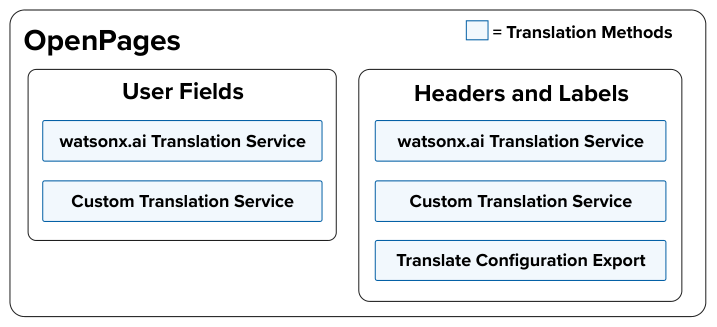

The goal of this solution doc is to outline a clear and actionable plan for implementing a translation service leveveraging watsonx.ai on the OpenPages platform. This solution doc enables the cability to translate two core components:
* **Headers and Labels**
    - The platform's user interface text for components like, titles, buttons, etc.
* **User Inputted fields**
    - All the text assiciated with the content in which users can input on the OpenPages platform.

This solution doc will address how to implement a translation method for each of the areas mentioned above, as well as outline the necessary requirements for building out each solution component to ultimately demonstrate a successful implementation of a watsonx.ai driven translation service on the OpenPages platform.

### Business Statement

A client needs to explore different options for multi-lingual support in various languages including English, Japanese, and Brazilian Portuguese due to the depraction of Watson Language Translate.

### Challenges
* Operational and business continuity is at risk with WLT's capabilities disappearing in December, 2024.
* Introducing a third-party solution (like NeuralSeek) presents third-party vendor risks to the client and requires additional scrutiny, thereby threatening the timeline for implementing a replacement solution and incurring additional costs due to evaluation. ​

### Business Outcomes
* Business and operational continuity between global risk and compliance teams​
* Mitigated third party risk of introducing new vendor as a part of this solution​ 
* Seamless user experience for translating OpenPages text​

## Solution Overview
-----

OpenPages content that can be translated falls under one of the two groups:

1. **User fields**
A label is a descriptive text for controls or input fields, helping users understand actions or required information. Examples include:
    * Button text (e.g., "Submit")
    * Dropdown text (e.g., "Select a Country")
    * Form field labels (e.g., "Username")

2. **Headers and labels:**
The header and labels on the OpenPages platform refers to the static text on the platform.
    A header is a prominent text element used as titles for pages, sections, or major content areas. Examples include:
    * Page titles (e.g., "Dashboard")
    * Section titles (e.g., "Account Information")
    * Navigation titles (e.g., "Home")

### Translation Methods
User fields and "headers and labels" can be translated through different methods:

####  <b> watsonx.ai Translation Service </b> 

####  <b> Custom Translation Service </b> 

**Goal:** Replicate Watson Language Translator and/or NeuralSeek's translation behahavior by providing transient translations across all user-inputted fields with the click of a button.

**Solution:** Develop an API wrapper to provide translations with wxai while also referencing any custom dictionaries, which specify and clearly define the prefered transaltions of certain headers/labels from the client.

**How to implement:** TODO

####  <b> Translate OpenPages Configuration Export </b> 
**Goal:** Perform a bulk update to the translation values of headers and labels on OpenPages.

**Solution:** Translate all headers and labels by translating the platform's Configuration Export with wxai and re-importing the Configuration Export into OpenPages, while levraging any custom dictionaries from the client.

​

​