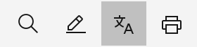

Once a translation service has been set up, user-inputted fields can be translated for transitory use. Individual fields must be selected one at a time for translation, and the output from the service will not be saved.

### Where it's used

1. Navigate to any page within OpenPages where the translation button appears.

    

2. Depening on what locale the user is in, the button will translate the fields to that target locale language.
    
    *Example below translating Janapese in an English locale*
    

### How to Implement

The UI-based translation can be configured one of two ways:
1. OpenPages watsonx.ai translation service

    To translate using one of the two native translation services (NeuralSeek/watsonx.ai), complete the setup process as described in the [product documentation](https://www.ibm.com/docs/en/openpages/9.0.0?topic=integrations-translation-services). See [here](../../Create/Translate%20User%20Fields/Native%20Translation%20Service) for more information.

2. Custom translation service

    To translate the necessary headers/labels with wx.ai an API wrapper is required to simulate the API response that is expected from the NeuralSeek configuration within OpenPages. Navigate [here](../../Create/Translate%20User%20Fields/Custom%20API%20Endpoint) for a walkthrough on how to implement the API wrapper.