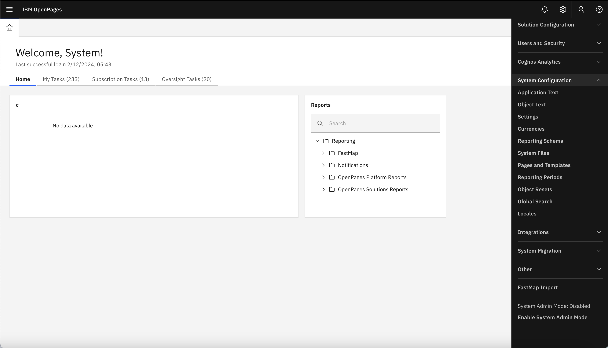
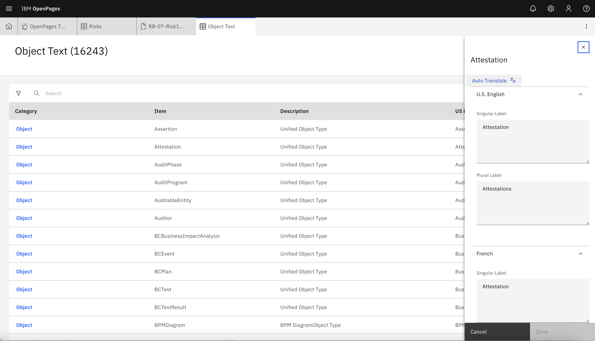
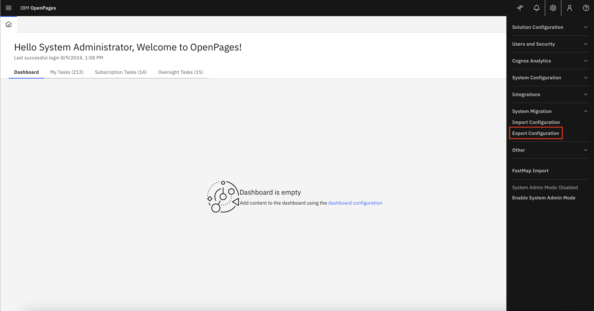
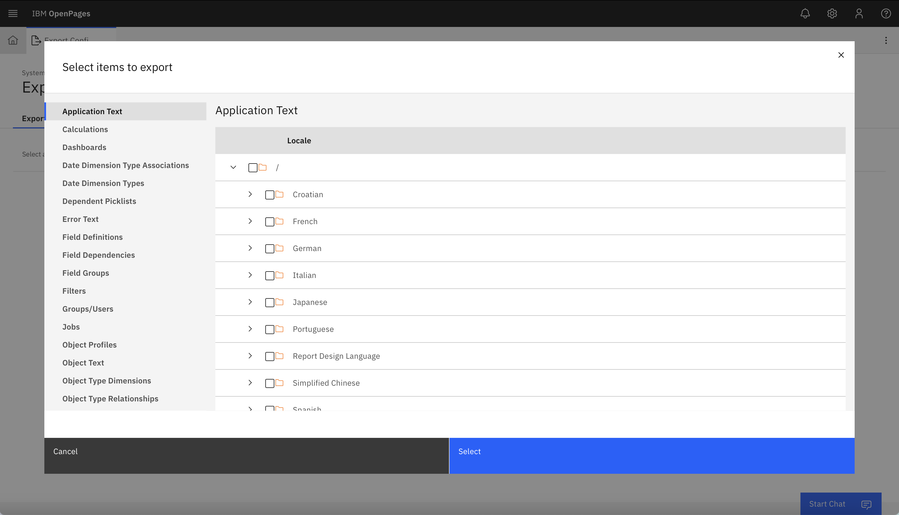
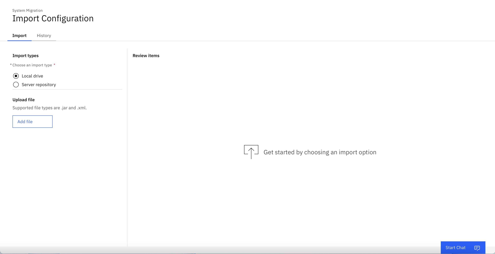

Aside from the default feature of using the "Locale" to translate the headers and labels, translatations can be carried out through two methods:
* **Method 1:** Translate Individual Items from the UI.
* **Method 2:** Translating and reuploading the configuration exports within OpenPages.

## Method 1: Translate Individual Items from the UI.
--------

### Where it's used

Translations on the headers and labels can be carried out on the OpenPages platform through the "System Configuration" and/or "Application Text", etc. by using the connected transltion service.

1. Navigate to the "Open Administrator Menu", select "System Configuration", and select either "Application Text" or "Object Text".

    

2. Select one of the items in the list, and select "Auto Translate" in the pop-up window on the right to carry out the relevant translations. Click "Done".

    

### How to Implement

The UI-based translation can be configured one of two ways:
1. OpenPages watsonx.ai translation service

    To translate using one of the two native translation services (NeuralSeek/watsonx.ai), complete the setup process as described in the [product documentation](https://www.ibm.com/docs/en/openpages/9.0.0?topic=integrations-translation-services). See [here](../../Create/Translate%20User%20Fields/Native%20Translation%20Service) for more information.

2. Custom translation service

    To translate the necessary headers/labels with wx.ai an API wrapper is required to simulate the API response that is expected from the NeuralSeek configuration within OpenPages. Navigate [here](../../Create/Translate%20User%20Fields/Custom%20API%20Endpoint) for a walkthrough on how to implement the API wrapper.

## Method 2: Translate Configuration Export
--------

### Where it's used

Another way to translate the headers/labels for the OpenPages platform is by exporting the necessary configuration files, translating the data, and then re-importing the translated configuration file back into the OpenPages platform.

**Export the configuration**
1. Navigate to the "Open Administrator Menu", select "System Migration", and choose "Export Configuration".

    
2. Select "Add Items +", choose "Application Text" from the list and select all necessary items and select "Select"

    

**Translate the exported configuration file with wx.ai**

Use the parse_config.py file under the Translate Configuration Export folder of [this repository](https://github.com/ibm-client-engineering/solution-openpages-wxai-translation) to parse the XML config file and translate the non-translated fields.

:::info
The code as it is currently written is intended for translating English fields to Japanese. The program will check using a regex parser for Japanese text to verify whether or not that field needs to be translated. You may need to implement a different system to check if a field should be translated.
:::
:::info
The configuration export file also includes code for downloading an excel file from OpenPages to use as a preset dictionary to check for BEFORE using generative AI to translate. You may or may not want to use a system like this.
:::

**Import the configuration**
1. Navigate to the "Open Administrator Menu", select "System Migration", and choose "Import Configuration".

    

### How to Implement
* Work in progress

