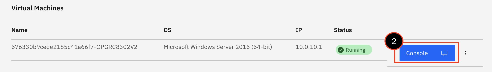
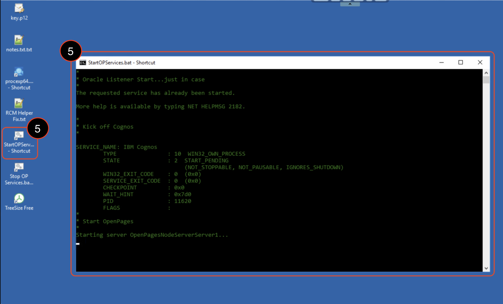
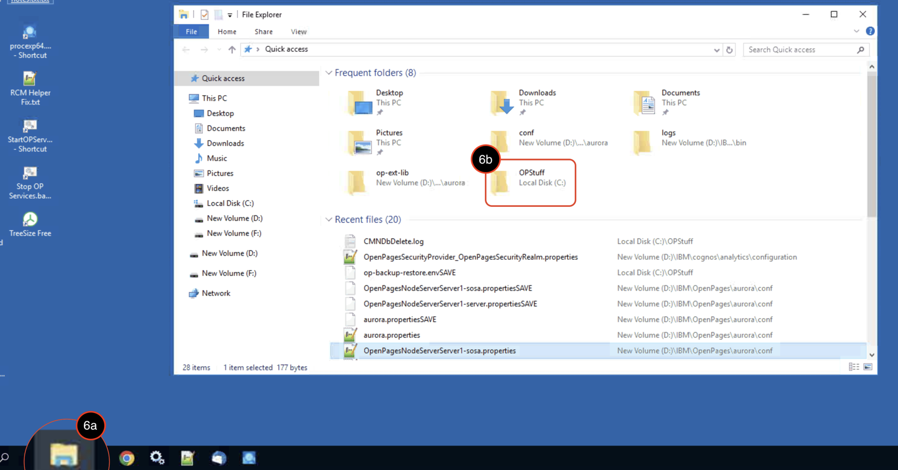
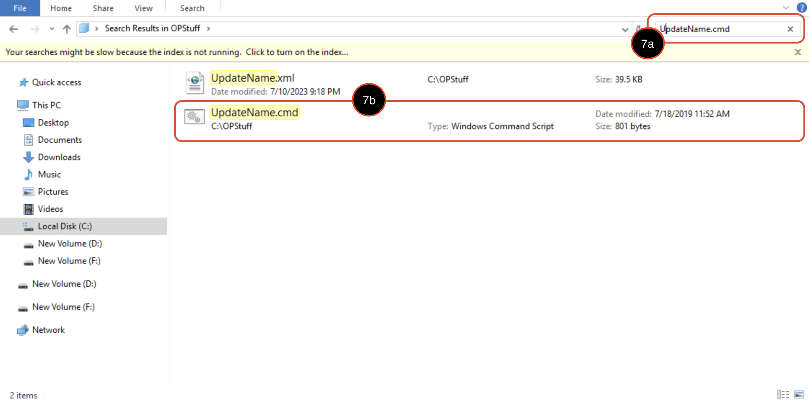
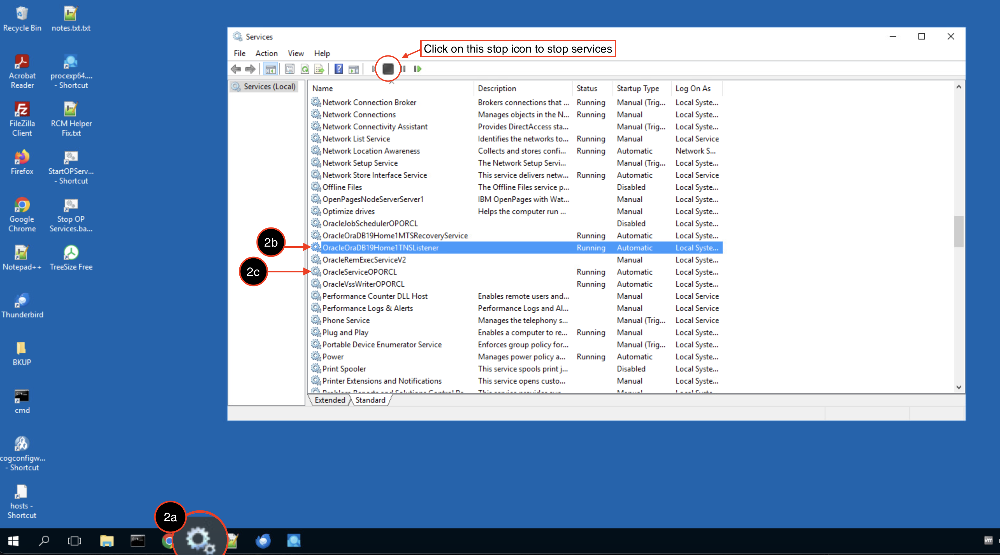
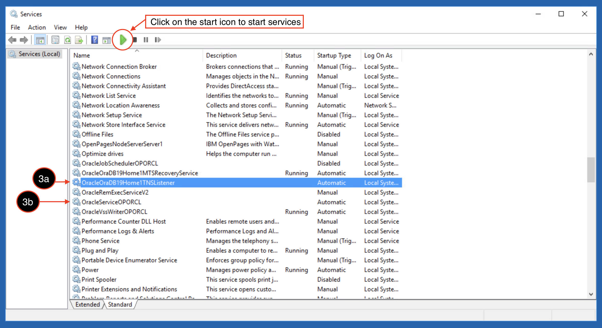
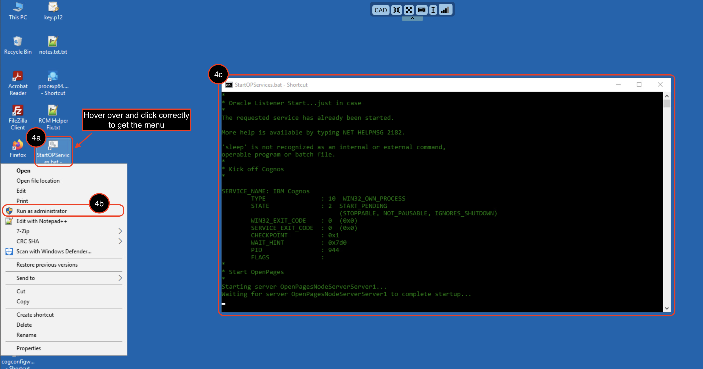

## **IBM OpenPages**

Before starting the integration between OpenPages and watsonx.ai, the OpenPages environment needs to be setup since the integration will be happening in the application. When going through the guideline below, there might be some errors occuring. If that happens, go to `Troubleshootings Options` to debug. 
### **Techzone Prerequisites**
----
1. Provision an [OpenPages version: 9.0.0.4](https://techzone.ibm.com/collection/open-pages-grc-9x/environments) Techzone environment.
2. When the environment is ready, scroll down to `Virtual Machines` and click on the console button to open the virtual machine that will run OpenPages.

    

3. To land on the login page for MAC users, click the Control Alt Delete (CAD) on the top of the console. Then log in with the credintials provided by the environment.

    

4. After logging in, check if the network icon has a red x market at the bottom right of the desktop screen. If so, scroll down to the `Troubleshooting Options for OpenPages Environment Setup` Option A and follow those instructions.

    
    
5. If not, Click on `"StartOPServices.bat"` on the Desktop. Once the instance is successful on starting, the window will close on its own.
        
    
    
6. Navigate to the `File Explorer` and click on `OPStuff` folder. 

    

7. Search for `UpdateName.cmd` and click the file.

    
    
8. Press any key to continue.
9. To find the details of the DNS name and new port: jump back to the Techzone reservation, under `Published Services` look for the OpenPages url link:
    * Example URL Breakdown:
        * OpenPages URL: `yourTZurl.example.com:<yourPort#>/..`
        * New DNS Name: `yourTZurl.example.com`
        * New public Port: `yourPort#`
    * The window will automatically close when it's done.
10. Run the `"StartOPServices.bat"` file on the Desktop. The process will take a few seconds but once it's successful, the file will automatically close.
11. Go back to the Techzone reservation, under `Published Services`: click on the OpenPages url link. If successful, the login page for OpenPages will populate on a new tab. Log in with the credintials provided by the environment.

### **Troubleshooting Options**
----
#### *Option A: Network Issue*
If the steps above were not successful, go back to the console button, click on the three dots next to it, and select reboot. Relogin with the administrator username and password. Then follow the process below: 

    1. If there is a red x mark on the network setting, then that means you are not connected to the network. To fix this issue, click the icon and click network settings. Then click on status where you can fix the error by clicking on "Troubleshoot". Let it run, when populated: click "Try these repairs as an administrator". This step is successful when the network status is connected.

        
    
    2. Once the network is connected, go back to the desktop and at the bottom click on the gear icon (services). Look for `OracleOraDB19Home1TNSListener` and stop it first. Then look for `OracleServiceOPORCL` and stop it. 

        
    
    3. After they have fully stop, re-start `OracleOraDB19Home1TNSListener` and wait until it finishes. Then re-start `OracleServiceOPORCL`. 

        
    
    4. When they are both done, go back to your Desktop and look for the icon that says `"StartOPServices.bat"`. In order for this to run properly, you NEED to run it as an administrator. 
        * If you have a MAC laptop, hover over the icon and click on it with two fingers on the trackpad and the option to `run as administrator` should pop up. Click on it. 
        * If you have a window laptop, hover over the icon and right click. The `run as administrator` option should show up. Click on it.  

        
    
    5. Wait for the system to finish starting. Once the OpenPages environment is completed, the terminal will automatically disappear on its own.
    
    6. Lastly, go back to the Techzone reservation, under `Published Services`: click on the OpenPages url link. If successful, the login page for OpenPages will populate on a new tab. Log in with the credintials provided by the environment.

#### *Option B: Application Idled for Too Long*
If the OpenPages application has beend idle for a few days, then the OpenPages login page will not load. This means the Openpages application has ended and needs to be restarted within the console. 
    1. Log back into the console.
    2. Look for `"StartOPServices.bat"` on the Desktop.
    3. Right click or press with double finger on the trackpad to run the `"StartOPServices.bat"` shortcut as an Administrator. 
    4. Once the terminal disappears on it own, the application is up and running again. 
    5. Go back to the OpenPages url and it should populated the OpenPages login page.