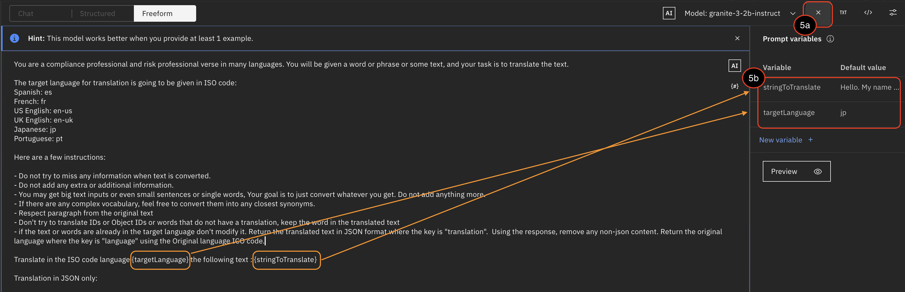
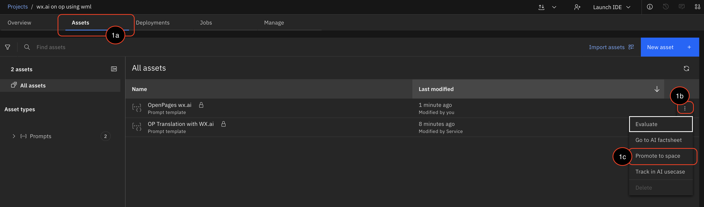
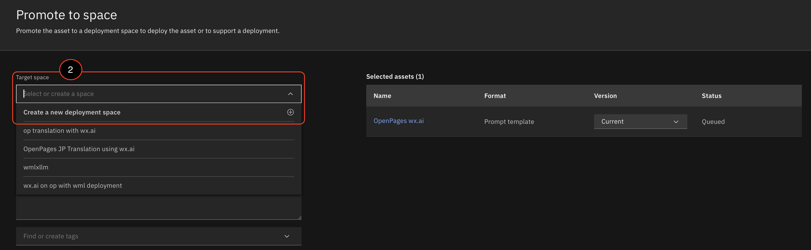
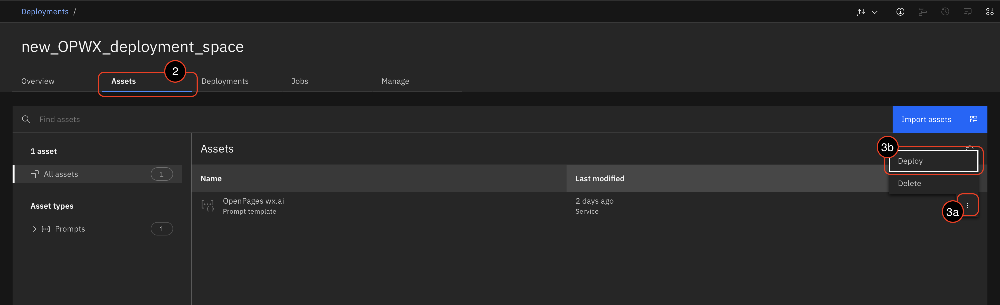
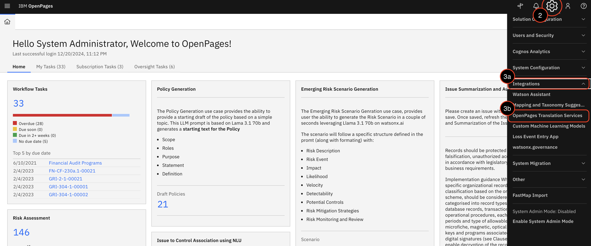
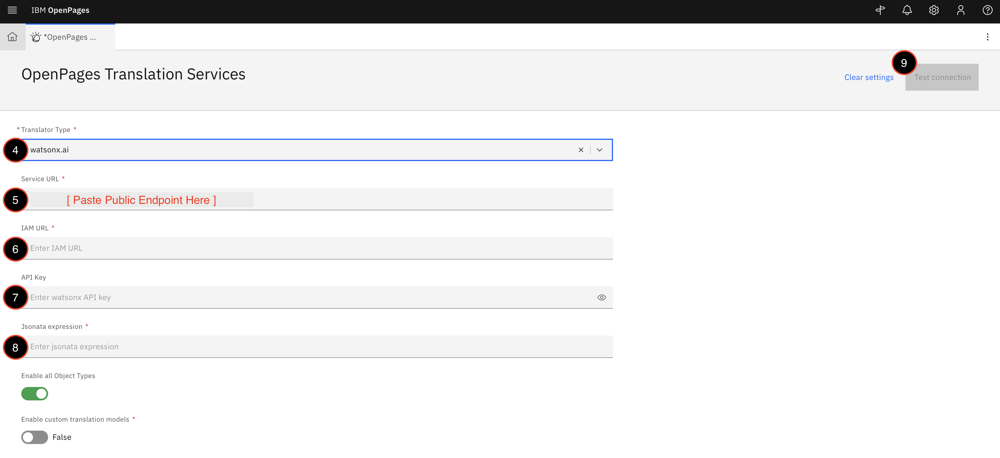
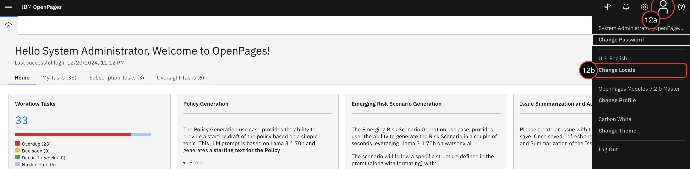
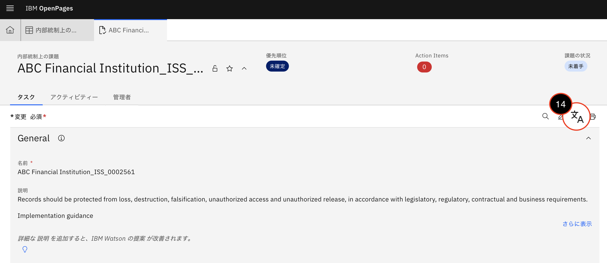

<div style={{ borderBottom: '1px solid #000', marginTop: '20px', marginBottom: '20px' }}></div>
## Overview
----
When translating the content within the user fields, OpenPages utilizes watsonx.ai to leverage various large language models (LLMs) to translate the selected fields to their desired language with a click of a button. The simplicity of using watsonx.ai with OpenPages to translate content enables users to meet GRC or business needs and requirement without skipping a beat. 

## Technical Details
----
Before we integrate watsonx.ai into OpenPages, there are 4 main parts to get watsonx.ai set up for maxuium usage. The first critial part is to make sure an API and a watsonx.ai runtime (WML) are created for the project. After setting up those resources, the prompt lab will be generated to call on LLMs to translate the selected fields to the desired language. In this case, we would be translating English to Japanese. This is where it gets hands-on to encourage developers to create their own prompts to generate the best translated outcome. Once the prompt lab portion is completed, this resource will get promoted and deployed for an easy integration into OpenPages. Below is a guide on how to accomplish the 4 main sections and integrate into the OpenPages application.

### **Prerequisites**
    * Generate an API Key
        - Here is a guide on [how to create an API key](https://cloud.ibm.com/docs/account?topic=account-userapikey&interface=ui). Make sure to download the key or save the key somewhere since this will be used later. 
    * Create a watsonx.ai runtime (WML) resources
        - Nagivate to your ibm cloud account. On the left hand side, click on the menu button and click `Resource list`. This is where a new watstonx.ai resource can be created which would be integrated later into the project.
    * Create a watsonx project
        - Under the watsonx services, create a watsonx project. This is where the watsonx.ai runtime is integrated under manage > service & integration > add the watsonx.ai runtime as an assoicated resources. Also, add a new prompt lab asset under `Assets` as this is where the prompt lab lives. 

### **Utilizing Watsonx.ai's Prompt Lab to Generate Translation**

    For this example scenairo, the task is to build a freeform prompt lab that will translate selected user fields from English to Japanese. 

    Guidelines for creating the prompt:
   
    1. First focus on providing context on what the task is. This will allow the model to understand what it needs to accomplish with the given background.
    2. Provide clear instructions for the model to perform to successfully translate the user fields. 
    3. In order for this to work properly, the variables `{targetlanguage}` and `{stringToTranslate}` will need to be used. 
        * `{targetlanguage}`: Refers to the desired language to translate to. OpenPages dynamically set these variables that are invoked using the ISO code of language used in OpenPages.
        * `{stringToTranslate}`: Refers to the text to be translated. This variable is represented as an input from OpenPages. 
    4. After the prompt is created, test out various models to use but for this example: `granite-3-2b-instruct` to translate from English to Japanese. For better results, play around with the parameters until the outcome is the desired outcome. 

    Here is an example prompt:
    ```code
    You are a compliance professional and risk professional verse in many languages. You will be given a word or phrase or some text, and your task is to translate the text.

    The target language for translation is going to be given in ISO code:
    Spanish: es
    French: fr
    US English: en-us
    UK English: en-uk
    Japanese: jp
    Portuguese: pt

    Here are a few instructions:

    - Do not try to miss any information when text is converted.
    - Do not add any extra or additional information.
    - You may get big text inputs or even small sentences or single words, Your goal is to just convert whatever you get. Do not add anything more.
    - If there are any complex vocabulary, feel free to convert them into any closest synonyms.
    - Respect paragraph from the original text
    - Don't try to translate IDs or Object IDs or words that do not have a translation, keep the word in the translated text
    - if the text or words are already in the target language don't modify it. Return the translated text in JSON format where the key is "translation".  Using the response, remove any non-json content. Return the original language where the key is "language" using the Original language ICO code.

    Translate in the ISO code language {targetLanguage} the following text : {stringToTranslate}

    Translation in JSON only: 
    ```
    5. To set the variables on the prompt lab, click on the `{#}` icon next to identifing the model. 

         

    6. Save as prompt template once the prompt is in a good position, so it to be used to promote and deploy.

        

### **Promote Prompt Lab to Space**
    1. Under the projct created with the prompt lab, select Assets, and promote your prompt lab.
        
        
    
    2. On the Promote to space page, if there isn't a dedicated deployment space then `Create a new deployment space` under `Target Space`. When creating the space, select the watsonx.ai runtime created earlier for this project. Once created, make sure to select the newly created space under `Target space` to promote to. 
        
        

### **Deploy the Prompt Lab**
    1. Once you have promoted your prompt lab to a dedicated space, nagivate into your newly created deployment space.
    2. Click the assets tab and under the asset tab, there should be the prompt lab that was promoted earlier. 
    3. Click the 3 dots on the right and click on deploy.

    

    4. Fill out the `Create Deployment` text fields and hit create. This will create a deployed prompt lab resource for OpenPages to use for the watsonx.ai service integration. 
    5. When the deployment is successful, click on the new deployment. Under `API reference` tab, keep note of the public endpoint as this will be used for the deployment to communicate with OpenPages for translation. 

### **OpenPages Integrations**

Now that the prompt lab is deployed along with OpenPages set up and the API key created, this is where everything is puzzled together to use the watsonx.ai service on the OpenPages application to translate the user fields to the desired language. In this case, the desired translation is Japanese. 
1. Nagivate to the reserved OpenPages 9.0.04 Techzone environment, under `Published services` click on the OpenPages url. If the environment is done correctly, the log in page for the OpenPages should populate in a new tab. If not, refer back to the `Prepare` section and debug the error or slack: Arvin Lin (alin@ibm.com) to get the OpenPages application up and running. 
2. After logging in, the OpenPages Welcome Page should populate. Nagivate to the gear icon on the right of the nav bar. Click on it. 
3. Under `Integrations`, select `OpenPages Translation Services`. This is where the integration between the deployed prompt lab and OpenPages will happen.



4. Switch Translator Type to watsonx.ai. 
5. Go back to the `API reference` tab under the created deployment above and copy the public endpoint. Paste the public endpoint under `Service URL`. 
6. Under `IAM URL`, paste: https://iam.cloud.ibm.com
7. Remember the API key created for this project, copy the API key and paste it under `API key`.
8. Under `Jsonata expression`, paste: $eval(results.generated_text).translation
9. With all the text fields filled, before saving, check if the test connection is successful. If so, an alert box will notify that it has been successful. If not, the alert box will notify that it has been unsuccessful. If it has been unsuccessful double check if the inserted values for the fields are correct and if the prompt has the two variables included. If not, go back and redeploy. 



10. Save the integration!
11. After the integration has been saved, nagivate back to the welcome page and change the locale of the application. 
12. On the top right, click on the person icon on the nav bar. Click on `Change Locale` to change the locale to the desired translation language. In this case, it would be Japanese.



13. Now nagivate to a page that the translation is needed. In this case, the `ABC Financial Institution_ISS_0002561` under `Issues` was selected as an example. 
14. Activate the translation button by clicking on the icon below.  



15. Once clicked, `View Original` will populate under the selected user fields (currently, it will be under the locale lanaguage). Click on `View Original` and it will translate from English to Japanese. FYI: Not all fields will have that feature unless it was pre-identified to have that capabilities. 


Congratulations! If you have gotten this far to the very end, then you have successfully completed an end-to-end pipeline of translating user fields by integrating OpenPages with watsonx.ai using a deployed prompt lab. This allows a smooth, easy, and quick process to utilize watsonx.ai's capabilities to translate to the desired lanaguage to meet your client's GRC requirements or any other compliance and risk business needs on OpenPages.