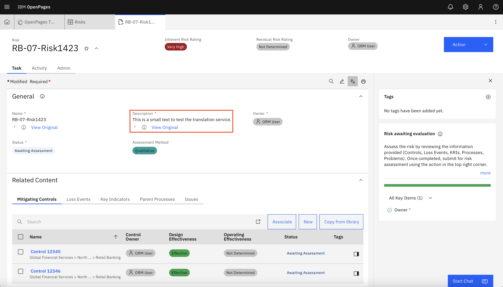

<div style={{ borderBottom: '1px solid #000', marginTop: '20px', marginBottom: '20px' }}></div>

### Translating with NeuralSeek from an OpenPages perspective
To initially validate a NeuralSeek endpoint for translation, OpenPages will send a POST request to `<endpoint>/translate/` with the body `{text: ["test connection"], "target": "en"}` (be aware that it will use a trailing slash, which may cause issues for some backend frameworks). This is also the same format that OpenPages will use for all translation requests, always with a single string in the target field's array and with no indication of source language.

The output that OpenPages expects is: 
```json
{
    "character_count": <int>, 
    "detected_language": <string>, 
    "detected_language_confidence": <float>, 
    "translations": [<string>],
    "word_count": <int>
}
```

OpenPages will also send the API key that you provide as basic authorization. For the purposes of our POC we ignored it.

### Translating with OpenPages from a NeuralSeek mimic perspective
The main step you need to complete before running the application is to create a `.env` file with the requisite credentials:

```bash
WX_PROJECT_ID=<watsonx Project ID>
WX_API_KEY=<watsonx API Key>
WX_API_URL=<watsonx API url>
```

### Technical details
When creating the `/translate` endpoint there are two steps to completing the translation using an LLM. The first step is to identify the source language, which we did by using a prompt that gave a the LLM only two options. This probably improved the accuracy of the source language detection but its proficiency in dinstinguishing a wider variety of lanugages is unknown.

The second step is to do the translation, using the source language information determined in the first step. We wanted the prompt to be modular enough so that we could use it for any combination of source and target language, although in our case we are only using it for English -> Japanese. To that end, we kept a dictionary of examples for the same phrase in every language we wanted to support for this translation, so that we could easily access the translation examples for the LLM to use. We also directed the LLM to output the translation within a JSON object, which allows us to use the closed curly bracket "}" as a stop sequence.

To host this endpoint, we utilized IBM Code Engine, which can run containers in a fairly straightforward way. Code Engine uses an x86 architecture, so when you build the container image for the translation endpoint specify at least the `linux/amd64` platform. We built the image using podman buildx and hosted it on dockerhub. From there, you can create a new application on Code Engine and specify the Image reference as the image you pushed to dockerhub. As long as the image repo you pushed it to is public, you shouldn't need a registry secret. In addition, this application doesn't need a lot of power to run, so you can be conservative with the allocation of compute resources. You also will not need more than one instance of the container.

There's also a `/history` endpoint for debugging, as we do not recommend trying to use Code Engine's lackluster logging.

### Outcome
Once the container has been set up and the integration saved in the OpenPages application, the translation feature will be enabled. There are two primary avenues for using this feature, translating object pages and auto-translating configuration text.

On any object page, there is a translation icon near the top right of the main tile. Clicking it will send a series of requests to the endpoint that we set up, and after the translations have completed the page will update to show the translated text. The text is translated from whatever language it is in originally into the language specified by the user's locale. Each translated field will also have a button to show the original, untranslated text.

<figure>
    
    <figcaption> Before </figcaption>
</figure>

<br/>
<br/>

<figure>
    
    <figcaption> After </figcaption>
</figure>

<br/>
<br/>

To use the auto translate feature for configuration text, navigate to the right side bar under the settings icon (gear), and expand the "System Configuration" list.


 Select the category of configuration text you would like to translate. You will find a list of fields that OpenPages stores as part of its configuration, along with associated translations. There is a button on the top to automatically translate the text fields for each locale using the translation service we set up. In our case, it fails for every language except English and Japanese due to a lack of support.


