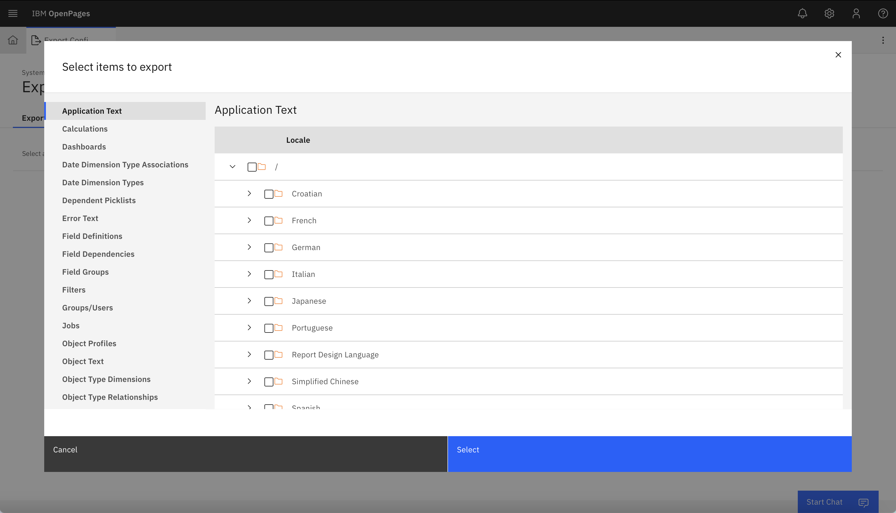

## Manual Headers and Labels Translation

Translations on the headers and labels can be carried out on the OpenPages platform through the "System Configuration" and/or "Application Text", etc. by using a connected transltion service. The "Auto Translate" button will attempt to translate from the original US English text into every locale that is enabled on OpenPages. 

1. Navigate to the "Open Administrator Menu", select "System Configuration", and select either "Application Text" or "Object Text".

    

2. Select an item from the list that you would like to translate, and select "Auto Translate" in the pop-up window on the right to carry out the relevant translations. Click "Done".

    

## Translate Configuration Export

If you would like to translate the entire OpenPages system at once, you can export parts or all of the configuration, edit the configuration files, and then reimport the updated translations. To start, you must first export the desired application text.

**Export the configuration**
1. Navigate to the "Open Administrator Menu", select "System Migration", and choose "Export Configuration".

    
2. Select "Add Items +", choose "Application Text" from the list and select all necessary items and select "Select"

    

**Translate the exported configuration file with wx.ai**

Use the parse_config.py file under the Translate Configuration Export folder of [this repository](https://github.com/ibm-client-engineering/solution-openpages-wxai-translation) to parse the XML config file and translate the non-translated fields.

The code as it is currently written is intended for translating English fields to Japanese. The program will check using a regex parser for Japanese text to verify whether or not that field needs to be translated. You may need to implement a different system to check if a field should be translated. This system may utilize generative ai in a case where the language's characters are not easily distinguishable from English.

:::info
The configuration export file also includes code for downloading an excel file from OpenPages to use as a preset dictionary to check for BEFORE using generative AI to translate. You may or may not want to use a system like this.
:::

**Import the configuration**
1. Navigate to the "Open Administrator Menu", select "System Migration", and choose "Import Configuration".

    

    

